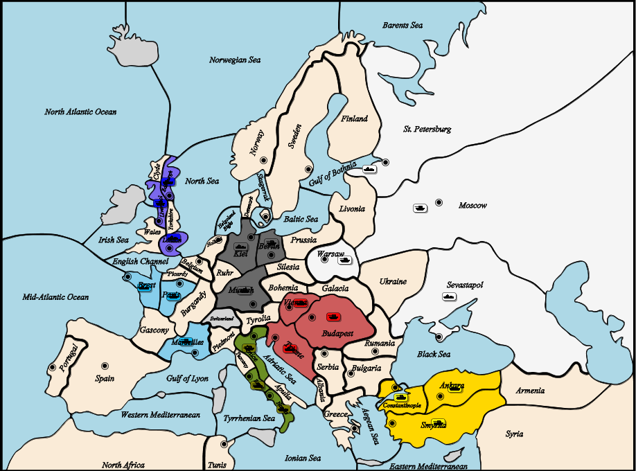
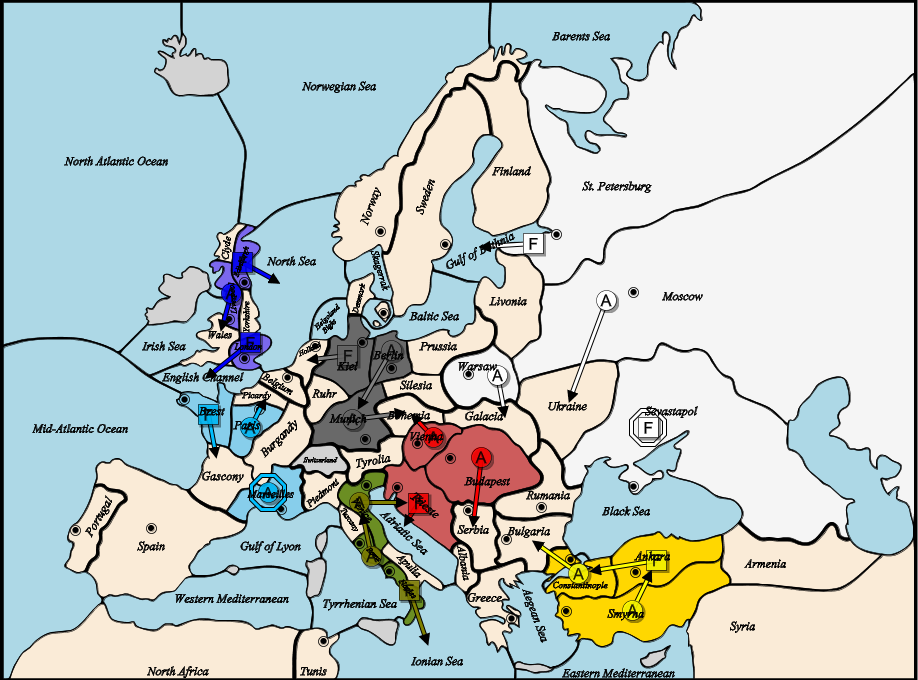
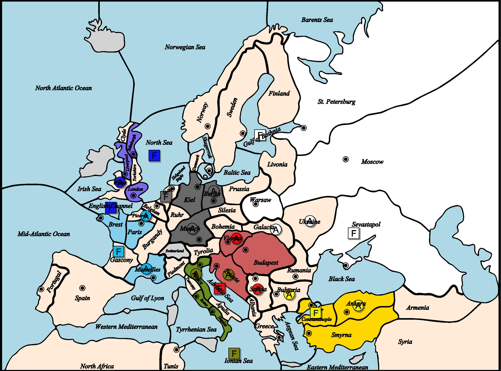
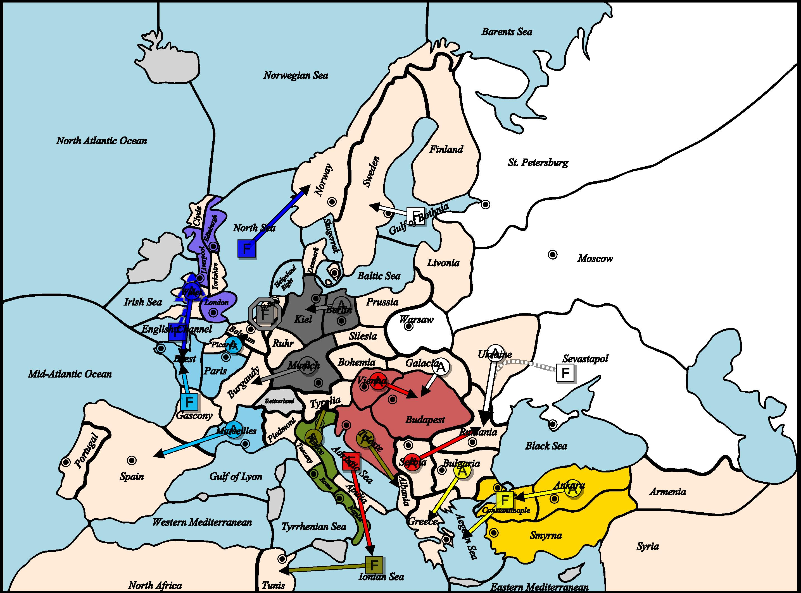
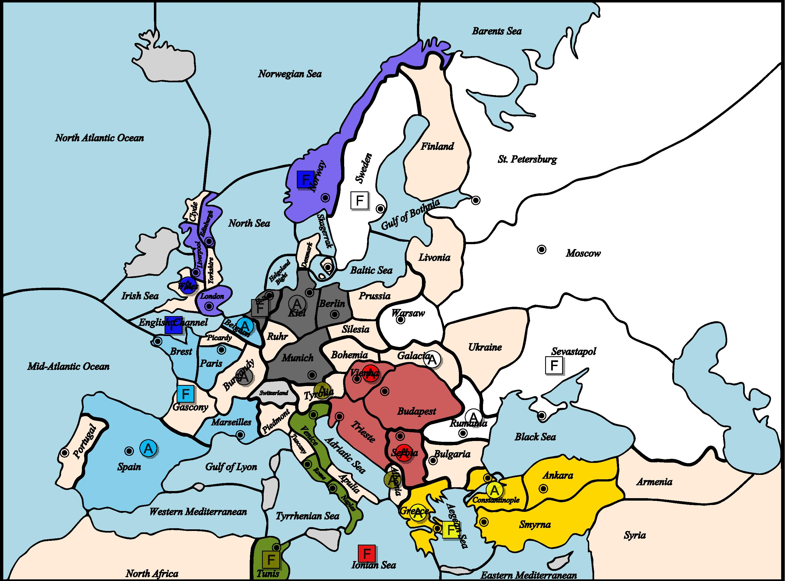

# 👑 1901년 외교 및 턴 기록

## 📜 봄 (Spring)

📜 1901년 봄 (이동 단계) 결과
📣 일반 공지:
후퇴할 유닛이 없어 후퇴 단계는 생략되었습니다.

### 🗺️ 명령 결과

**오스트리아**
- 육군 부다페스트 → 세르비아 이동
- 함대 트리에스테 → 아드리아해 이동
- ❌ 육군 비엔나 → 보헤미아 이동 (뮌헨과 충돌, 1:1 상쇄)

**영국**
- 함대 에든버러 → 북해 이동
- 육군 리버풀 → 웨일스 이동
- 함대 런던 → 영국 해협 이동

**프랑스**
- 함대 브레스트 → 가스코뉴 이동
- 육군 마르세유 대기 (Hold)
- 육군 파리 → 피카르디 이동

**독일**
- ❌ 육군 베를린 → 뮌헨 이동 (뮌헨이 이동 실패로 미점령 상태 유지)
- 함대 킬 → 홀란드 이동
- ❌ 육군 뮌헨 → 보헤미아 이동 (비엔나와 충돌, 1:1 상쇄)

**이탈리아**
- 함대 나폴리 → 이오니아해 이동
- 육군 로마 → 베네치아 이동
- 육군 베네치아 → 트리에스테 이동

**러시아**
- 육군 모스크바 → 우크라이나 이동
- 함대 세바스토폴 대기 (Hold)
- 함대 상트페테르부르크/남해안 → 보스니아만 이동
- 육군 바르샤바 → 갈리시아 이동

**터키**
- 함대 앙카라 → 콘스탄티노플 이동
- 육군 콘스탄티노플 → 불가리아 이동
- 육군 스미르나 → 앙카라 이동

## 📜 가을 (Fall)

📜 1901년 가을 (이동 단계) 결과
📣 일반 공지:
후퇴할 유닛이 없어 후퇴 단계는 생략되었습니다.

### 🗺️ 명령 결과

**오스트리아**
- ⭐ 보급 센터 획득 → 신규 유닛 1개 건설 가능
- 함대 아드리아해 → 이오니아해 이동
- ❌ 육군 세르비아 → 루마니아 이동 (우크라이나와 충돌, 1:1 상쇄)
- ❌ 육군 비엔나 → 부다페스트 이동 (갈리시아와 충돌, 1:1 상쇄)

**영국**
- ⭐ 보급 센터 획득 → 신규 유닛 1개 건설 가능
- 함대 영국 해협: 육군 웨일스를 브레스트로 수송 (Convoy)
- 함대 북해 → 노르웨이 이동
- ❌ 육군 웨일스 → 브레스트 이동 (가스코뉴와 충돌, 1:1 상쇄)
- ↳ 수송 경로: 웨일스 → 영국 해협 → 브레스트

**프랑스**
- ⭐ 보급 센터 획득 → 신규 유닛 2개 건설 가능
- ❌ 함대 가스코뉴 → 브레스트 이동 (웨일스와 충돌, 1:1 상쇄)
- 육군 마르세유 → 스페인 이동
- 육군 피카르디 → 벨기에 이동

**독일**
- ⭐ 보급 센터 획득 → 신규 유닛 1개 건설 가능
- 육군 베를린 → 킬 이동
- 함대 홀란드 대기 (Hold)
- 육군 뮌헨 → 부르고뉴 이동

**이탈리아**
- ⭐ 보급 센터 획득 → 신규 유닛 1개 건설 가능
- 함대 이오니아해 → 튀니스 이동
- 육군 트리에스테 → 알바니아 이동
- 육군 베네치아 → 티롤리아 이동

**러시아**
- ⭐ 보급 센터 획득 → 신규 유닛 2개 건설 가능
- ❌ 육군 갈리시아 → 부다페스트 이동 (비엔나와 충돌, 1:1 상쇄)
- 함대 보스니아만 → 스웨덴 이동
- 함대 세바스토폴 → 우크라이나의 루마니아 진격을 지원
- 육군 우크라이나 → 루마니아 이동

**터키**
- ⭐ 보급 센터 획득 → 신규 유닛 1개 건설 가능
- 육군 앙카라 → 콘스탄티노플 이동
- 육군 불가리아 → 그리스 이동
- 함대 콘스탄티노플 → 에게해 이동

## 📜 겨울 정산 (Winter/Build)

🛠️ 1901년 가을 (조정 단계) 결과

### 🏗️ 조정 명령 결과

**오스트리아**
- 육군 부다페스트 신규 배치

**영국**
- 함대 런던 신규 배치

**프랑스**
- 육군 마르세유 신규 배치
- 육군 파리 신규 배치

**독일**
- 육군 뮌헨 신규 배치

**이탈리아**
- 육군 나폴리 신규 배치

**러시아**
- 육군 모스크바 신규 배치
- 육군 바르샤바 신규 배치

**터키**
- 함대 스미르나 신규 배치

## 📜 1901년 총평

🌍 유럽 대륙 격동의 서막! - 1901년 외교 전쟁 개막
📰 Diplomatic Times | 1901년 연말 특집호

유럽, 칼날 위의 외교 무대에서 첫 발을 내딛다
1901년, 유럽 대륙은 무력과 외교가 엇갈리는 대격변의 해로 기록될 예정이다. 7개 열강이 본격적인 세력 확장을 위해 발을 내딛은 가운데, 격전지는 중부 유럽과 동유럽, 그리고 지중해로 좁혀졌다.

🟥 오스트리아, 동부 관문에서 충돌
부다페스트에서 루마니아까지 진출 시도했으나 러시아와 충돌
오스트리아는 세르비아, 아드리아해, 보헤미아로 진출하며 야망을 드러냈으나, 루마니아 및 부다페스트에서 러시아와의 충돌로 고전했다. 결국 신병은 부다페스트에 배치되어 내륙 방어를 강화하는 모습이다.

🟦 영국, 바다의 패권 장악 시작
노르웨이 점령 성공, 브레스트 상륙은 프랑스와 격돌
영국은 북해와 영국 해협을 장악하고 노르웨이 점령에 성공, 함대를 런던에 추가 배치하며 해양 통제를 강화했다. 다만, 육군 웨일스의 브레스트 상륙 시도는 프랑스와의 1:1 충돌로 실패하며 대륙 개입에는 제동이 걸렸다.

🇫🇷 프랑스, 벨기에와 스페인 확보… 그러나 브레스트 위기
육상 확장은 순조, 해안 방어엔 구멍
프랑스는 피카르디와 마르세유에서 각각 벨기에와 스페인을 점령, 성공적인 확장을 이뤘다. 하지만 브레스트에는 영국이 수송 병력을 투입하며 함대 가스코뉴와 충돌, 해안 방어에 경고등이 켜졌다. 이에 마르세유와 파리에 육군 2기 배치, 본토 방어 의지를 분명히 했다.

🇩🇪 독일, 조심스러운 확장… 중앙유럽 견제 집중
홀란드 점령, 부르고뉴로 압박
독일은 홀란드 점령에 성공하고, 뮌헨에서 부르고뉴로 진출하며 프랑스를 견제했다. 군 병력은 뮌헨에 재배치, 향후 양면 전선 대비에 나선 모양새다.

🇮🇹 이탈리아, 튀니스 확보… 동유럽 개입 예고
알바니아, 티롤리아 진입으로 오스트리아·독일에 견제 구도 형성
이탈리아는 함대를 통해 튀니스를 확보, 첫 해외 식민지를 손에 넣었다. 동시에 베네치아→티롤리아, 트리에스테→알바니아 진입으로 오스트리아와 독일 모두를 위협하는 위치에 들어서 향후 외교 전선의 중재자 혹은 방해자가 될 가능성이 커졌다.

🇷🇺 러시아, 북유럽과 동유럽 모두 진출
스웨덴·갈리시아·루마니아 동시 압박, 육군 2기 보강
러시아는 북쪽에서 스웨덴을 점령하며 북구 전략을 강화, 동시에 갈리시아와 우크라이나를 통해 오스트리아의 중심부를 압박했다. 루마니아 진출도 지원 명령을 통해 시도하며 다방면 전략을 구사했다. 모스크바와 바르샤바에 군 보강, 다음 국면의 핵심 플레이어로 부상 중이다.

🇹🇷 터키, 조용하지만 의미 있는 성장
그리스 점령, 에게해 진출 성공… 스미르나에 함대 추가
터키는 불가리아에서 그리스로의 확장에 성공, 동지중해 패권의 기반을 다졌다. 동시에 에게해 진출에 성공, 지중해 함대의 기반을 마련했다. 스미르나에 함대 추가, 향후 이탈리아·오스트리아에 대한 해상 견제 가능성 주목
