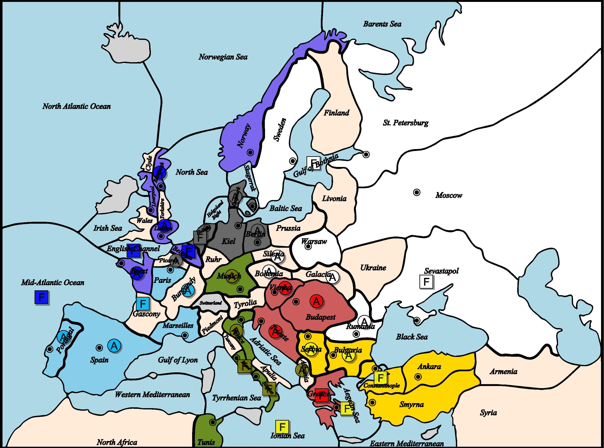
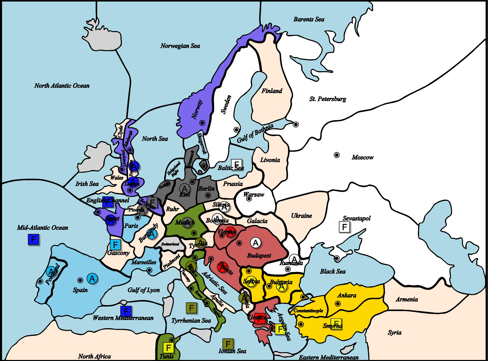
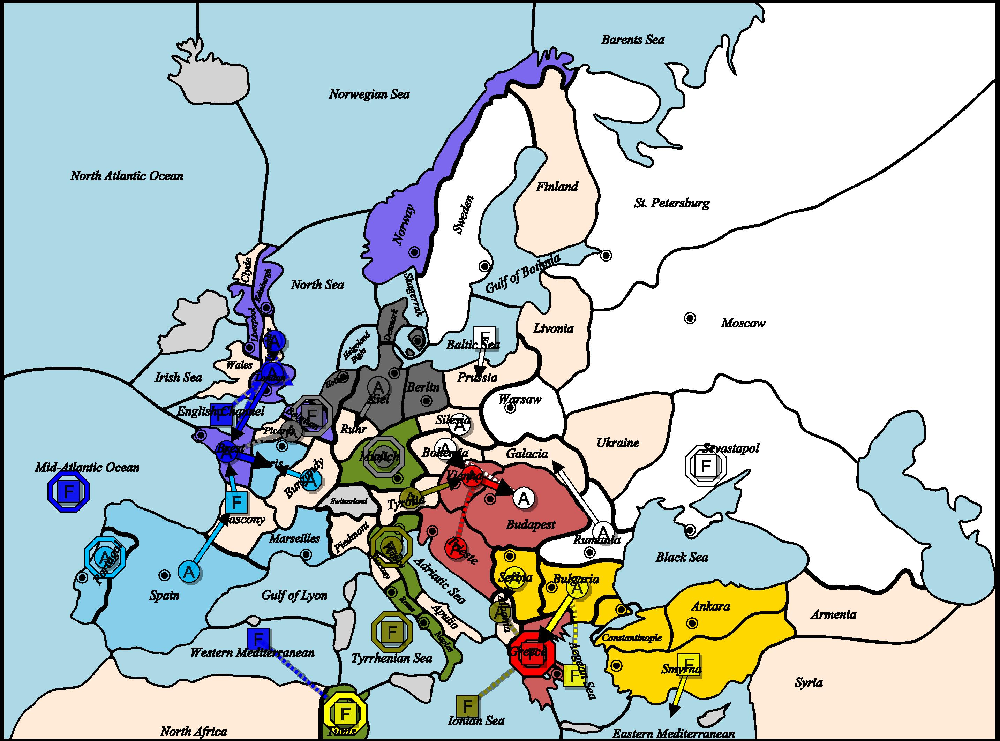

# 👑 1903년 외교 및 턴 기록

## 📜 봄 (Spring)

📜 1903년 봄 (이동 단계) 결과 요약

🇦🇹 오스트리아
- ❌ 육군 부다페스트 대기
　→ 갈리시아의 공격으로 격퇴됨 (2대1) : 부다페스트에 있던 육군은 퇴각 불가 → 유닛 소멸
- 함대 그리스 대기
- ❌ 육군 트리에스테가 부다페스트를 지원
　→ 세르비아의 공격으로 지원 차단됨
- ❌ 육군 비엔나가 부다페스트를 지원
　→ 보헤미아의 공격으로 지원 차단됨

🏴 영국
- 함대 벨기에 → 영불 해협 이동
- ❌ 육군 브레스트가 피카르디 → 파리 공격 지원
　→ 가스코뉴의 공격으로 지원 차단됨
- 육군 에든버러 → 요크셔 이동
- 함대 영불 해협 → 중부 대서양 이동
- 육군 런던 대기
- 함대 중부 대서양 → 서지중해 이동

🇫🇷 프랑스
- ❌ 육군 부르고뉴 → 파리 이동
　→ 피카르디와 충돌 (1대1)
- ❌ 함대 가스코뉴 → 브레스트 이동
　→ 브레스트와 충돌 (1대1)
- 육군 포르투갈 대기
- ❌ 육군 스페인 → 가스코뉴 이동
　→ 가스코뉴 함대가 브레스트 이동에 실패하여 연쇄 실패

🇩🇪 독일
- 육군 베를린 → 뮌헨 이동
- 육군 덴마크 → 킬 이동
- 함대 홀란드 → 벨기에 이동
- ❌ 육군 피카르디 → 파리 이동
　→ 부르고뉴와 충돌 (1대1)

🇮🇹 이탈리아
- 육군 알바니아가 그리스 함대를 지원
- ❌ 육군 뮌헨 대기 → 베를린 공격으로 격퇴됨 (2대1) : 티롤리아로 퇴각
- 함대 나폴리 → 이오니아 해 이동
- 함대 로마 → 티레니아 해 이동
- 육군 베니스 대기

🇷🇺 러시아
- ❌ 육군 보헤미아 → 비엔나 이동
　→ 비엔나와 충돌 (1대1)
- 육군 갈리시아 → 부다페스트 이동
- 함대 보스니아만 → 발트해 이동
- 육군 루마니아가 갈리시아 → 부다페스트 공격 지원
- 함대 세바스토폴 대기
- 육군 실레지아가 베를린 → 뮌헨 공격 지원

🇹🇷 터키
- 함대 에게해가 불가리아 → 그리스 공격 지원
- ❌ 육군 불가리아 → 그리스 이동
　→ 오스트리아-이탈리아 연합과 충돌 (2대2)
- 함대 콘스탄티노플 → 스미르나 이동
- 함대 이오니아 해 → 튀니스 이동
- ❌ 육군 세르비아 → 트리에스테 이동
　→ 트리에스테와 충돌 (1대1)

## 📜 가을 (Fall)

📜 1903년 가을 (이동 단계) 결과

🇦🇹 오스트리아
- 함대 그리스 대기
- 육군 트리에스테가 비엔나 → 부다페스트 공격 지원
- 육군 비엔나 → 부다페스트 이동 성공

🏴 영국
- 육군 브레스트 → 파리 이동
- ❌ 함대 영불 해협이 육군 런던 → 브레스트 수송
- ❌ 육군 런던 → 브레스트 이동 실패
　→ 브레스트에서 가스코뉴와 충돌 (1대1), 수송 실패
　→ 수송 경로: 런던 → 영불 해협 → 브레스트
- 함대 중부 대서양 대기
- 함대 서지중해가 튀니스 함대를 지원
- ❌ 육군 요크셔 → 런던 이동 실패
　→ 런던 이동이 브레스트 실패로 인해 연쇄 실패

🇫🇷 프랑스
- ❌ 육군 부르고뉴 → 파리 이동
　→ 브레스트에서 온 영국군과 충돌 (1대1)
- ❌ 함대 가스코뉴 → 브레스트 이동
　→ 런던에서 온 영국군과 충돌 (1대1)
- 육군 포르투갈 대기
- ❌ 육군 스페인 → 가스코뉴 이동 실패
　→ 가스코뉴 함대가 브레스트 이동에 실패했기 때문에 연쇄 실패

🇩🇪 독일
- 함대 벨기에 대기
- 육군 킬 → 루르 이동
- 육군 뮌헨 대기
- 육군 피카르디가 브레스트 → 파리 공격을 지원

🇮🇹 이탈리아
- ❌ 육군 알바니아가 그리스 함대를 지원
　→ 세르비아에서 온 터키군의 공격으로 지원 차단됨
- 함대 이오니아 해가 그리스 함대를 지원
- ❌ 육군 티롤리아 → 비엔나 이동
　→ 보헤미아에서 온 러시아군과 충돌 (1대1)
- 함대 티레니아 해 대기
- 육군 베니스 대기

🇷🇺 러시아
- 함대 발트해 → 프로이센 이동
- ❌ 육군 보헤미아 → 비엔나 이동 실패
　→ 티롤리아에서 온 이탈리아군과 충돌 (1대1)
- ❌ 육군 부다페스트가 보헤미아 → 비엔나 공격 지원
　→ 비엔나에서의 공격으로 격퇴됨 (2대1) : 루마니아로 후퇴
- 육군 루마니아 → 갈리치아 이동
- 함대 세바스토폴 대기
- ❌ 육군 실레지아 → 보헤미아 이동 실패
　→ 보헤미아가 비엔나 이동에 실패했기 때문에 연쇄 실패

🇹🇷 터키
- 함대 에게해가 불가리아 → 그리스 공격 지원
- ❌ 육군 불가리아 → 그리스 이동 실패
　→ 그리스 수비 세력과 충돌 (2대2)
- ❌ 육군 세르비아 → 알바니아 이동 실패
　→ 알바니아와 충돌 (1대1)
- 함대 스미르나 → 동지중해 이동
- 함대 튀니스 대기

## 📜 1903년 총평

🌍 유럽 대전략: 1903년, 균형이 무너지는 해
📰 Diplomatic Times | 1903년 연말 특집호
― 본격적인 중부 유럽 전투, 각국의 희비 교차
1903년, 유럽 전역은 이전보다 더 복잡하고 격렬한 전쟁의 물결 속으로 빨려들어 갔다. 전선은 명확히 갈리고, 강대국들은 점점 더 적과 아군을 명확히 구분짓기 시작했으며, 수많은 진군과 후퇴, 배신과 연합 속에 유럽의 판도가 흔들리고 있다.

🏴 영국 – 해상 장악력 강화, 서부 진출 가속화
영국은 전년도에 이어 해상 주도권을 유지하면서 브레스트 탈환을 시도했지만, 프랑스와의 접전에서 뜻밖의 교착 상태를 맞이했다.
봄: 런던 → 브레스트 상륙을 위한 영불해협 수송 작전을 준비했으나, 가스코뉴발 방해로 지원이 끊기며 실패.
가을: 다시 브레스트 상륙을 시도했지만 가스코뉴와의 충돌로 또다시 무산.
▶ 한 해 내내 서부 해안 탈환에 실패, 군을 이동시키지 못해 런던에도 병력이 묶임.
결과: 점령지 증가 없이 교착 상태. 하지만 여전히 영불해협~지중해 라인에 함대를 유지하며 해상 전략 기반은 유지 중.

🇫🇷 프랑스 – 연속된 후퇴, 전선 재정비 불가피
프랑스는 서부에서 영국, 중부에서 독일과의 격돌 끝에 보급 센터 감소와 군 축소라는 치명타를 맞았다.
봄: 브레스트 재탈환을 위해 가스코뉴 함대 이동, 부르고뉴 육군으로 파리 진입 시도했지만 모두 실패.
가을: 브레스트 방어 실패, 부르고뉴 육군은 해체 조치.
▶ 함대와 육군이 겹쳐 이동하며 자기 발목을 잡은 모양새.
▶ 최종적으로 1개 유닛 제거, 전선 재정비가 시급.

🇩🇪 독일 – 중부 유럽의 재건, 병력 대거 확충
독일은 1903년 키엘, 베를린, 뮌헨 등 핵심 도시를 수성하면서, 주변 지역으로 지속적인 군 배치를 실시했다.
봄: 베를린 → 뮌헨 진군 성공, 중앙 방어선 회복.
가을: 브레스트를 노리는 영국과의 협공을 시도하며 피카르디 육군으로 파리 진군, 키엘에서 루르까지 병력 확장.
▶ 실질적 점령지 증가와 동시에 군 2기 증설: 베를린, 키엘에 각각 육군 배치.
결과: 중부 유럽 내 탄탄한 방어망 구축 완료, 본격적인 공격 준비가 가능해졌다.

🇦🇹 오스트리아 – 기사회생, 재도약의 발판 마련
1902년까지 후퇴 일변도였던 오스트리아는 1903년 후반 빈-부다페스트-트리에스테 삼각 라인을 회복하며 반격의 발판을 마련했다.
봄: 부다페스트 방어 실패, 갈리시아군에게 밀려나 병력 소멸.
가을: 빈-트리에스테 협공으로 부다페스트 재탈환 성공, 보급 센터 1개 회복.
▶ 빈에 육군 1기 증설. 드디어 회복세 돌입.
결과: 발칸 전선은 여전히 불안하지만, 중심부 재장악에 성공, 기사회생의 기회를 만들었다.

🇮🇹 이탈리아 – 양면전선의 실패, 대패의 해
이탈리아는 독일과 오스트리아 전선 양측에 병력을 분산했지만, 지원 부족과 터키의 견제로 결정적 실패를 맞았다.
봄: 뮌헨에서 방어 실패 → 티롤리아로 후퇴, 알바니아 지원도 실패.
가을: 티롤리아에서 빈 진격 실패, 세르비아군의 알바니아 공격에 밀리며 지원 끊김.
결과: 2개의 보급 센터 상실, 알바니아·베니스 육군 해체.
▶ 이탈리아는 주요 병력 손실과 함께 전략적 재정비가 불가피한 상황에 직면.

🇷🇺 러시아 – 중부 전선 진출, 고군분투의 확장
러시아는 갈리시아, 보헤미아, 실레지아를 통한 중부 유럽 침투에 집중했지만, 결정적인 성과는 제한적이었다.
봄: 갈리시아 → 부다페스트 점령 성공. 실레지아-베를린 협공으로 뮌헨 장악 시도.
가을: 보헤미아 → 빈 진격 실패, 부다페스트는 오스트리아 반격에 밀려 루마니아로 퇴각.
결과: 유닛 증가 없이 현상 유지. 대규모 병력 운용은 유지했지만 전선 확보에는 실패.

🇹🇷 터키 – 해상 확장과 발칸 유지, 안정된 상승세
터키는 발칸에서 병력 균형을 유지하면서 동지중해~튀니지 라인까지의 해상 진출에 성공, 안정적 확장을 이뤘다.
봄: 불가리아 → 그리스 진격 시도 실패. 세르비아 → 트리에스테도 교착.
가을: 불가리아 → 그리스 재공격 실패. 세르비아 → 알바니아 공격 성공, 이오니아해에서 튀니지 점령 성공.
결과: 1개 보급 센터 추가, 콘스탄티노플에 육군 증설.
▶ 해양 확장과 발칸 병력 운용을 모두 해내며 강국으로 입지 굳혀.

🧭 총평: 중부 유럽은 다시 불타고, 동맹은 시험대에
1903년은 중부 유럽을 둘러싼 전면 충돌이 가시화된 해였다.
오스트리아와 독일은 회복세에 돌입,
프랑스와 이탈리아는 결정적 후퇴와 병력 손실을 겪었으며,
러시아는 진출과 퇴각을 반복하며 안정된 확장을 확보하지 못하였다..
영국은 여전히 서부 진출에 실패했지만 해상 패권은 견고하며,
터키는 가장 안정된 확장을 달성하며 강국 대열에 합류했다.

💡 1904년은 진정한 세력 재편의 원년이 될 것으로 보인다.
각국은 이제 전면전을 준비하거나, 마지막 기회를 노려야 한다.

