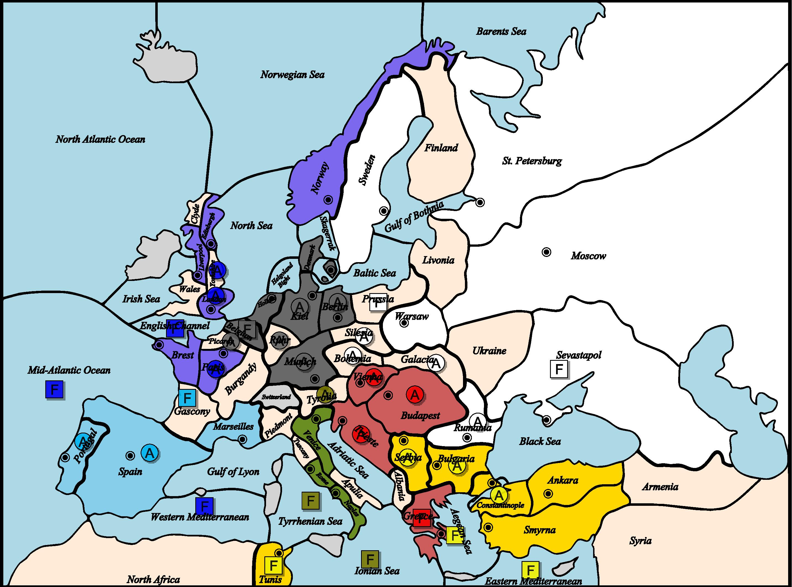
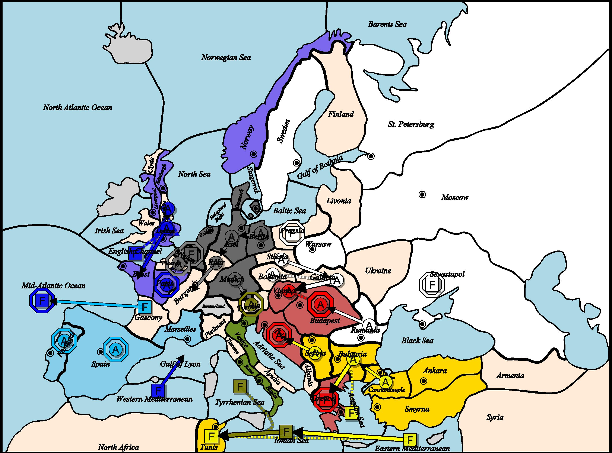
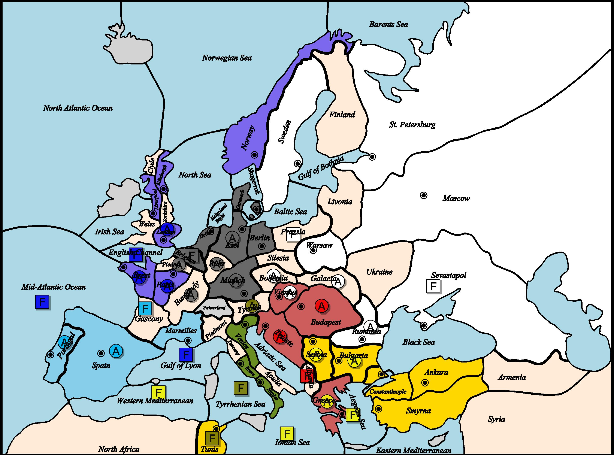
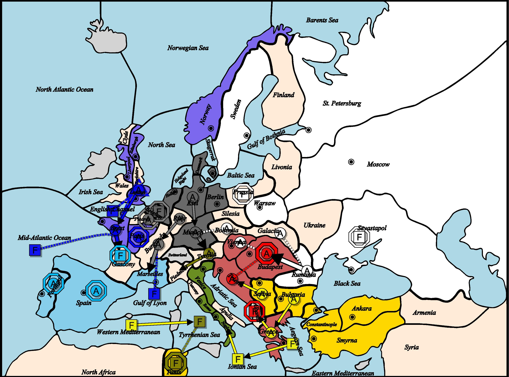

# 👑 1904년 외교 및 턴 기록

## 📜 봄 (Spring)

🗓 1904년 봄 (이동 턴) 결과

🇦🇹 오스트리아
❌ 육군 비엔나가 부다페스트를 지원
　→ 갈리치아에서 온 러시아군의 공격으로 지원 차단됨
　→ 갈리치아와 루마니아의 협공(2대1)으로 격퇴됨 (퇴각 불가로 소멸)
육군 부다페스트 대기
함대 그리스 대기
　→ 불가리아에서 온 터키군의 협공(2대1)으로 격퇴됨 : 알바니아로 후퇴
육군 트리에스테 대기

🏴 잉글랜드
함대 영불해협이 런던 → 브레스트 수송
육군 런던 → 브레스트
　→ 수송 경로: 런던 → 영불해협 → 브레스트
함대 중대서양 대기
육군 파리 대기
함대 서지중해 → 리옹만
육군 요크셔 → 런던

🇫🇷 프랑스
❌ 함대 가스코뉴 → 중대서양
　→ 중대서양의 영국 함대와 충돌 (1대1)
육군 포르투갈 대기
육군 스페인 대기

🇩🇪 독일
함대 벨기에 대기
육군 베를린 → 킬
육군 킬 → 루르
❌ 육군 뮌헨 → 티롤리아
　→ 티롤리아에 있는 이탈리아군과 충돌 (1대1)
육군 피카르디 대기
육군 루르 → 부르고뉴

🇮🇹 이탈리아
함대 이오니아 해 → 튀니지
육군 티롤리아 대기
함대 티레니아 해가 이오니아 해 → 튀니지 이동 지원

🇷🇺 러시아
육군 보헤미아가 갈리치아 → 비엔나 이동을 지원
육군 갈리치아 → 비엔나
함대 프로이센 대기
❌ 육군 루마니아 → 부다페스트
　→ 부다페스트 오스트리아군과 충돌 (1대1)
함대 세바스토폴 대기
육군 실레지아 → 갈리치아

🇹🇷 터키
함대 에게해가 불가리아 → 그리스 이동을 지원
육군 불가리아 → 그리스
육군 콘스탄티노플 → 불가리아
함대 동지중해 → 이오니아 해
❌ 육군 세르비아 → 트리에스테
　→ 트리에스테 오스트리아군과 충돌 (1대1)
❌ 함대 튀니지, 동지중해 → 이오니아 해 이동 지원
　→ 이탈리아의 협공(2대1)으로 격퇴됨 : 서지중해로 후퇴

## 📜 가을 (Fall)

📜 1904년 가을 (이동 단계) 결과

🇦🇹 오스트리아
❌ 육군 부다페스트 대기 실패 — 루마니아에서 온 러시아군에 의해 격퇴됨 (3대1) : 후퇴할 곳이 없어 부대 해산
함대 알바니아 대기
❌ 육군 트리에스테가 부다페스트 방어 지원
　→ 세르비아에서 온 터키군의 공격으로 지원 차단됨

🏴 잉글랜드
육군 브레스트 → 가스코뉴 이동 성공
함대 영불 해협이 육군 런던 → 브레스트 수송
　→ 수송 경로: 런던 → 영불 해협 → 브레스트
함대 리옹만이 부르고뉴 → 마르세유 공격을 지원
육군 런던 → 브레스트 이동 성공
함대 중부 대서양이 브레스트 → 가스코뉴 공격 지원
육군 파리 대기

🇫🇷 프랑스
❌ 함대 가스코뉴 대기 실패 — 브레스트에서 온 잉글랜드군에 의해 격퇴됨 (2대1) : 후퇴할 곳이 없어 부대 해산
육군 포르투갈 대기
육군 스페인 대기

🇩🇪 독일
함대 벨기에 대기
육군 부르고뉴 → 마르세유 이동 성공
육군 킬 → 뮌헨 이동 성공
육군 뮌헨 → 티롤리아 이동
육군 피카르디 대기
육군 루르 → 부르고뉴 이동

🇮🇹 이탈리아
함대 튀니스 대기
육군 티롤리아 → 피에몬테 이동 성공
❌ 함대 티레니아 해가 튀니스 지원
　→ 서지중해에서 온 터키 함대의 공격으로 지원 차단됨

🇷🇺 러시아
육군 보헤미아가 뮌헨 → 티롤리아 이동 지원
육군 갈리치아가 루마니아 → 부다페스트 공격을 지원
함대 프로이센 대기
육군 루마니아 → 부다페스트 이동 성공
함대 세바스토폴 대기
육군 비엔나가 루마니아 → 부다페스트 공격을 지원

🇹🇷 터키
함대 에게해 → 이오니아 해 이동 성공
❌ 육군 불가리아 → 그리스 이동 실패
　→ 그리스에서 알바니아로 이동이 실패하면서 연쇄 실패
❌ 육군 그리스 → 알바니아 이동 실패
　→ 알바니아 수비 유닛과 충돌 (1대1)
함대 이오니아 해 → 나폴리 이동 성공
❌ 육군 세르비아 → 트리에스테 이동 실패
　→ 트리에스테 수비 유닛과 충돌 (1대1)
❌ 함대 서지중해 → 티레니아 해 이동 실패
　→ 티레니아 해 수비 함대와 충돌 (1대1)

## 📜 1904년 총평 (AI Summary)

📰 유럽 외교일보
1904년 정세 종합: 격동의 전선, 동유럽의 변화가 서유럽을 뒤흔들다
1904년, 외교전 유럽은 어느 때보다 격렬한 충돌과 전략적 전환으로 가득 찼다. 러시아의 공세가 결정적 국면에 진입한 가운데, 잉글랜드의 서방 지배력 강화, 독일의 내륙 전진, 터키의 해상 확장 등 각국은 저마다의 방식으로 영향력을 확대하고 있다. 한편 오스트리아와 프랑스, 이탈리아는 연속된 패배 속에 주도권을 잃고 있으며, 유럽 대륙은 새로운 판세를 맞고 있다.

🇷🇺 러시아: 유럽 중심으로의 질주
러시아는 비엔나 점령에 성공하며 오스트리아의 심장부를 장악했다. 동시에 부다페스트까지 침공, 오스트리아 육군을 궤멸시켰다. 이와 함께 모스크바와 바르샤바에서 병력을 증설하며, 본격적인 서진 체제를 갖추었다.
갈리치아-비엔나-부다페스트 삼각 공격 루트는 명확한 전략이었으며, 보헤미아-실레시아 방면에서 독일을 견제할 발판도 확보되었다.

🏴 잉글랜드: 서유럽의 실질 지배자
잉글랜드는 해상 교통망을 활용해 런던-브레스트-가스코뉴로 병력을 이동시키며 프랑스를 완전히 압박했다. 프랑스의 가스코뉴 함대 격파는 상징적 승리로, 중대서양, 리옹만, 영불 해협을 통한 공조는 강력한 해상 통제력을 입증했다.
잉글랜드는 지상 병력 없이도 프랑스 본토를 사실상 봉쇄하며, 독일과의 균형 속에 유럽 서부의 열쇠를 쥐고 있다.

🇩🇪 독일: 중앙 유럽의 중심 축
독일은 마르세유 진격을 통해 프랑스를 육상에서 압박하며, 한편으로 뮌헨에서 키엘로 전진, 키엘-루르-부르군디 라인을 재편했다.
신규 베를린 육군 증설은 러시아 견제를 암시하며, 동시에 프랑스 방면 확장을 위한 병참 강화의 일환으로 분석된다. 잉글랜드와의 무력 충돌은 없었으나, 접경지 유지 상태는 양국 간 긴장감을 유지시키고 있다.

🇹🇷 터키: 남유럽 진출 본격화
터키는 이오니아 해를 점령하고, 서지중해 진입을 시도하며 지중해의 주도권을 노렸다. 비록 티레니아 해 진입에 실패했지만, 스미르나에 함대를 증설하며 본격적인 해상 진출 의도를 명확히 했다.
지상에서는 그리스-알바니아 진입 시도가 좌절되고, 트리에스테 공략 실패로 다소 정체되었으나, 전반적으로 안정된 성장 기반을 다지고 있다.

🇮🇹 이탈리아: 남부 붕괴, 지중해 방어선 균열
이탈리아는 튀니지 방어에 성공했으나, 서지중해에서 터키의 압박으로 티레니아 해 지원이 차단되며 해상 주도권을 상실했다.
더욱 치명적인 타격은 터키 함대의 기습으로 나폴리를 상실한 것이다. 이로써 이탈리아 본토 남단이 뚫리며, 내륙과 해안 방어에 중대한 균열이 발생했다.
티롤리아 육군은 피에몬테로 이동, 프랑스-독일 접경 지역에서의 기동력을 모색하고 있으나, 이미 전략적으로 고립된 상황에서 큰 의미를 가지기 어렵다.
병력 증설 없이 수성만 겨우 이어가는 모습은, 이탈리아가 더 이상 공세를 이어가기 어려운 구조임을 방증한다

🇫🇷 프랑스: 유럽의 낙오자로 전락
프랑스는 1904년 한 해 동안 브레스트 상실, 가스코뉴 함대 궤멸, 그리고 독일-잉글랜드의 협공 속에서 속수무책으로 무너졌다.
포르투갈과 스페인 병력은 제자리에 묶였고, 병력 증감도 없어 사실상 지중해 서단의 고립된 섬처럼 남았다.
한때 유럽 서부의 주도국이던 프랑스는 지금, 해안에 고립된 채 재기의 실마리를 찾기 힘든 상황이다.

🇦🇹 오스트리아: 해체 직전, 생존 본능만 남아
오스트리아는 비엔나와 부다페스트를 모두 상실, 사실상 내륙 거점이 붕괴되었고, 유일한 희망이던 그리스 함대는 알바니아로 철수한 뒤 해산되었다.
이번 조정에서 알바니아 함대를 철수한 결과, **단 1기의 육군(트리에스테)**만 남겨두고 몰락의 끝자락에 있다.
주변 강국들의 충돌 속에서 완전한 소멸이 시간문제로 보인다.

🧭 결론: 1905년은 동서 패권의 분수령
잉글랜드-독일-러시아가 뚜렷한 성장세를 보이며 삼강 구도를 형성하고 있다. 반면 프랑스, 오스트리아, 이탈리아는 한계 상황에 직면해 있으며, 터키는 이 틈을 비집고 새로운 플레이어로 도약하고 있다.

다음 해, 누가 누구와 손을 잡고, 누구를 배신할 것인가. 외교의 향방이 전장을 뒤흔들 위기의 1905년이 도래했다.

